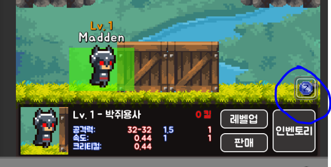
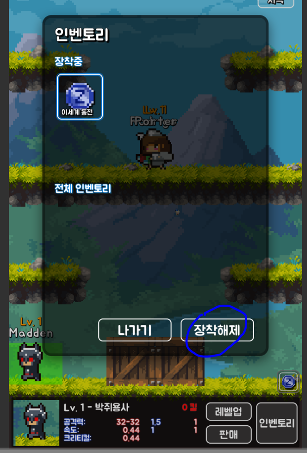

MessageBasedUnityProgramming
====

(Possible) Rx replacement programming pattern in Unity.

개요
----
메세지 기반 프로그래밍은 `PubSub` 패턴을 이용해, 오브젝트끼리 커플링되지 않고도 통신할 수 있는 방법을 제공합니다. 비록 루즈 커플링지만서도, C#이라는 언어 위에서 동작하기 때문에 추적이 쉽고, 주고받는 메세지를 저장한다면 오히려 더 쉬운 디버깅 환경을 제공합니다.

부모-자식 계층관계가 아닌 UI끼리 변경 감지하기
----





```cs
class ActiveTowerUI : Subscriber
{
  private void RebuildInventory()
  {
    // some handsome code goes here that rebuilds inventory ui
  }

  [Subscriber(typeof(ActiveTowerInventoryChangeMessage))]
  private void OnActiveTowerInventoryChange(ActiveTowerInventoryChangeMessage message)
  {
    RebuildInventory();
  }
}
```

아니면 간단하게 아래와 같이 줄여 쓸 수 있습니다.<br/>
(저는 위의 방법을 선호합니다.)
```cs
class ActiveTowerUI : Subscriber
{
  [Subscriber(typeof(ActiveTowerInventoryChangeMessage))]
  private void RebuildInventory()
  {
    // some handsome code goes here that rebuilds inventory ui
  }
}
```

다음은 실제로 인벤토리 팝업에서 `장착해제`를 눌러 인벤토리 상태 변경을 시도하는 코드입니다.
```cs
public class InventoryUI : MonoBehaviour 
{
  public void OnClickEquip()
  {
    // ....
    PubSub.Publish(new ActiveTowerInventoryChangeMessage());
  }
}
```


다수의 서브스크라이버
----


이 게임에서 타워는 HP가 모두 소진되면 죽은 상태가 되지만, 해당 웨이브가 종료된 시점에서 부활하여 다음 웨이브에 다시 전투에 참전합니다.

#### 구독자 코드 작성하기
```cs
class Tower : Subscriber
{
  [Subscriber(typeof(WaveEndMessage))]
  private void OnWaveEnd()
  {
    if (isAlive == false)
      Revive();
  }
}
```

#### 송신자 코드 작성하기
```cs
class WaveSpawner : MonoBehaviour
{
  private IEnumerator WaveLoop()
  {
    while (true) {
      // SPAWN SPAWN SPAWN
      yield return null;
    }
    // End of spawn

    while (enemies.Length > 0) {
      // WAIT WAIT WAIT
      yield return null;
    }
    // Wave cleared

    PubSub.Publish(new WaveEndMessage());
  }
}
```


파라미터가 있는 메시지
----

```cs
class WaveStartMessage {
  public int wave;
}
```
```cs
class WaveIndicatorUI : Subscriber
{
  [Subscriber(typeof(WaveStartMessage))]
  private void OnWaveEnd(WaveStartMessage message)
  {
    Narration.Show($"Wave {message.wave}!");
  }
}
```
```cs
PubSub.Publish(new WaveStartMessage() { wave = 1 });
```